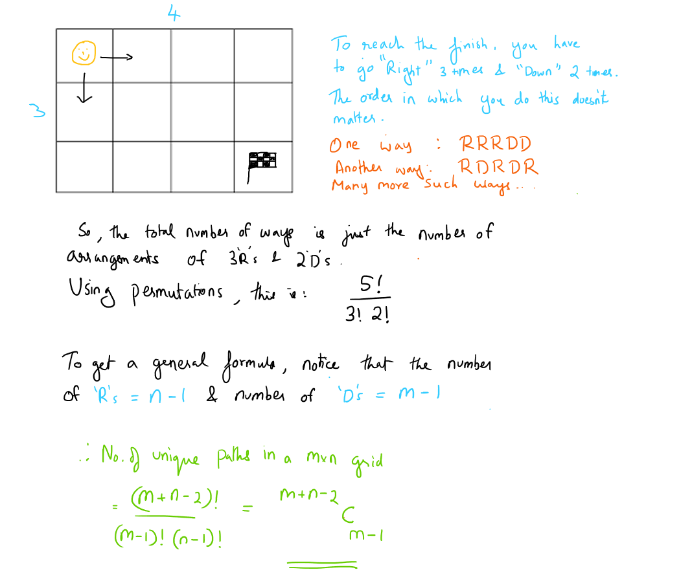

# Find Unique Paths
Problem Link: [findUniquePaths_codeBetter](https://www.hackerrank.com/contests/temp-1621067388/challenges/algorithm-find-unique-paths)

## Problem Statement
You are at the top left corner of a m x n grid. Your objective is to reach the finish line located at the bottom right corner.   
You may only move down or right at any point in time. How many possible unique paths are there?

### Approach 1 - Brute force Recursion [TLE]   
```cpp
int findUniquePaths(int m, int n)
{
	if ( m == 1 and n == 1) 
		return 1;
	if ( m <= 0 or n<= 0) 
		return 0;

	return findUniquePaths(m - 1, n) + findUniquePaths(m , n - 1); 
}
```
*Time complexity: O(2^(m+n))*   
*Space complexity: O(m+n)*

### Approach 2 - Dynamic Programming 
Since you can only move right and down, when you arrive at a point, you either arrive from left or above. If we use dp[i][j] for the number of unique paths to arrive at the point (i, j), then the state equation is dp[i][j] = dp[i][j - 1] + dp[i - 1][j]. Moreover, we have the base cases dp[0][j] = dp[i][0] = 1 for all valid i and j.
```cpp
int findUniquePaths(int m, int n)
{
	vector<vector<int>> dp(m, vector<int>(n, 1));
	for (int i = 1; i < m; i++) {
	    for (int j = 1; j < n; j++) {
		dp[i][j] = dp[i - 1][j] + dp[i][j - 1];
	    }
	}
	return dp[m - 1][n - 1];
}
```
*Time complexity: O(m\*n)*   
*Space complexity: O(m\*n)*

### Approach 3 - Using Math
Consider an example of a 3x4 grid. Refer the figure below for explanation  

```cpp
int findUniquePaths(int m, int n)
{
        int N = m + n - 2;
        int r = m - 1;
        long long res = 1;
        for (int i = 1; i <= r; i++)
            res = res * (N - r + i) / i;
        return res;
}
```
*Time complexity: O(m+n)*  
*Space complexity: O(1)*
